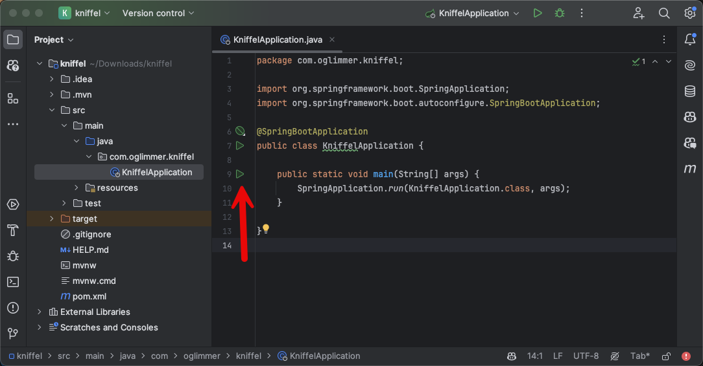
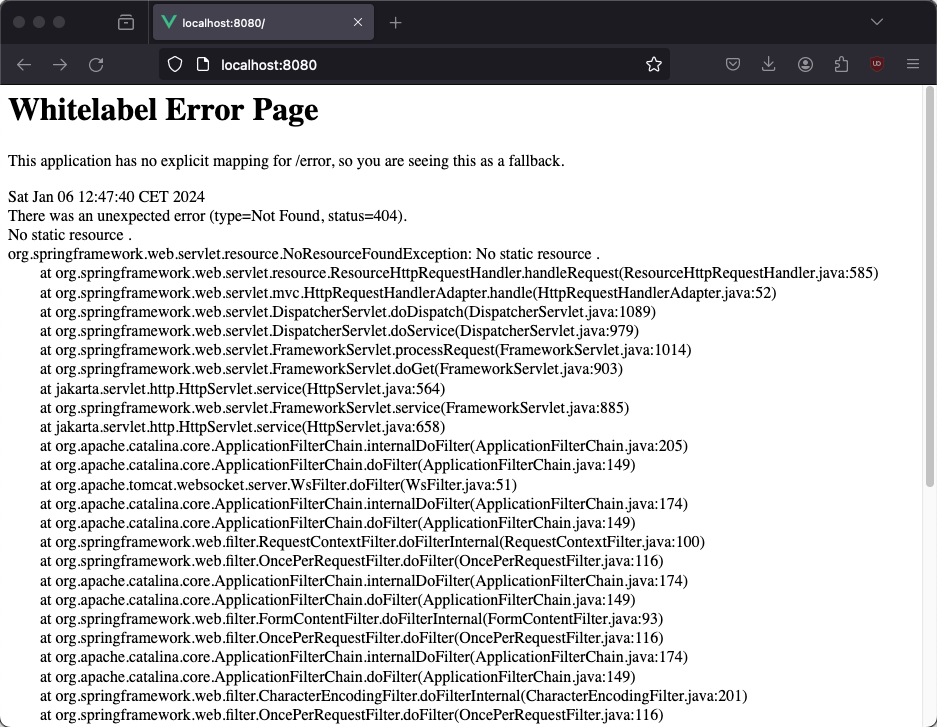

# Chapter 01

Base project generation and IDE

# Goal

You have a running REST API - without functionality but it returns http responses.

# Context and Knowledge

* Java is widely used in companies and enterprises and the job market for java developers is huge, interesting and well paid
* Java applications are backend or server applications. A UI / Desktop application in Java is not really a thing.
* Java applications are either **JEE** (Java Enterprise Application) or **Spring Boot**, we will look at Spring Boot
* what [REST](https://en.wikipedia.org/wiki/REST) is, is hard to grasp, but what people mean when they say "we have a REST API" is
    * http(s) as a network protocol - you can use a browser, JavaScript inside the browser or curl to use your REST API
    * it doesn't use cookies to maintain a session between subsequent calls, some REST APIs use cookies for authentication
    * data is often considered a resource and the URL represents that. To create a user you do POST on "/api/users", to retrieve all users you do GET on "/api/users", to load the user oli you do GET on "/api/users/oli".
    * usually JSON is used as input/output data format

## Step 1 - generate base project

* all Spring projects starts at https://start.spring.io/ - so you have to go there and create a basic project. the following sections will help you to make the right choices before you click Generate.

### how to build a project

* java projects are either build with "maven" or "gradle"
* maven is XML based and simple - it defines how the project is build, like the java version, its name and the dependencies
* gradle is groovy/kotlin based and more sophisticated (but more difficult to use)

### language

* Spring boot can be wirtten in Java, Kotlin or Groovy
* Java should be the default unless you have a good reason to use Kotlin (really nobody uses Groovy)

### Version

* Always go for the latest stable version

### Project metadata

* All Java projects (maven & gradle) need to have `group`. this is your reversed domain if you have a domain or your discord name. at the end it needs to make your project namespace unique. I always use com.oglimmer for my projects
* `Artifact` is your project name. for this should be kniffel.
* `Name` is your project name again. for this should be kniffel.
* `Package name` is again your group + artifact, so for me it is "com.oglimmer.kniffel" for this project.
* `Packaging` keep jar. Nobody uses war anymore.
* `Java` - up to you feel free to be frisky and go for the latest version.

Why is there ...

* group + artifact -> this is the name for "software package" living in a central repository (like https://mvnrepository.com/)
* package name -> this is the java package namespace

### Dependencies

Here it gets as complicated as you want ;)

Java and Spring Boot is made for enterprise applications - therefore it supports "everything".

We only need 3 dependencies for now:

* Spring Boot DevTools
* Lombok
* Spring Web

#### Spring Boot DevTools

it make development easier with "auto reload during dev time".

#### Lombok

this reduces the code you have to write massively. the lib provides java annotations so you don't have to type a lot of code. I think you should use.

#### spring Web

this dependency makes this project a REST API. without it, it is just a useless java program doing nothing at all.

## Step 2 - open in IDE and start the REST API server 

Click "generate" on https://start.spring.io/, download the zip, unzip and open in IntelliJ or VS Code.

Open src/main/java/your-package-names/.../.../KniffelApplication.java

This should compile and you don't see any errors.

Let's start the "Java Spring Boot Application" and see if it starts without errors.

### starting in intellij

You can run the program with one of the play icons, always use "debug"



### starting in vscode

Make sure you have all the vscode plugins for java, maven (or gradle) installed. this https://marketplace.visualstudio.com/items?itemName=vscjava.vscode-java-pack is a good start.

You can run the program with "debug" : 


### starting on command line

this is easy, but you won't have a debugger attached, so I would not recommend it for development. but I think it's good to know how to start a Spring application via terminal.

```bash
./mvnw spring-boot:run

# or on windows
./mvnw.bat spring-boot:run
```

### After started ....

After you have started the program it should look like this:


To test if the REST API is listening:

Open with a browser: http://localhost:8080 and you should see:



The error is ok, as we haven't added any content or endpoints, but we know that the REST API server is starting and processing http requests.

## Step 3 - ways to test a REST API ...

### the browser

any GET request can be tested with a browser - as we did above.

but you cannot easily test a POST, PUT, PATCH or DELETE request, so browser testing is not really ideal.

### command line using curl

I am a fan of the terminal, so I like REST API testing vial curl

```bash
curl "http://localhost:8080/" -v
```

this should show a similar result as the browser. with curl we can also test any request method (POST, PUT, etc.) and we have full control over all headers or parameters in general. I will get back to curl.

Also pay attention to the output, you can see bytes sent to the server as an "http request": they are marked with ">". And you can see the full "http response" from the server, all headers are marked with "<" and the body is just at the end. This is invaluable knowledge for debugging http/REST development.

### in the browser using Swagger / OpenAPI

we will set up the project in a way that itself offers a web page to test itself. this will look like this https://math.oglimmer.de/swagger/ui

### any other REST API testing applicatoin

There are many applications out there to test REST APIs. Maybe the most common one is https://www.postman.com/ - feel freel to check it out

## Step 4 - push to git

Create a new repo in your github/gitlab account and push your project there.

# What we've learnt

* all java projects are based on maven or gradle
* all java spring boot projects start on https://start.spring.io/
* selecting the right dependencies for a spring boot project can be tricky, ask someone who's familiar with spring boot
* REST is based on http and this can be examined in detail with `curl` on the command line

# Extras if you have time

* read the pom.xml - that's maven's build file. ask yourself if the content makes sense or why it is there
* to see all the project's dependencies, type:

```bash
./mvnw dependency:tree
```

as you can see the project already has many indrect dependencies. Fefe is not a fan ;)

* we can build a production version of the project

```bash
./mvnw package
```

This will create a "release package" as a jar in ./target. See target//kniffel-0.0.1-SNAPSHOT.jar

You can start with via

```bash
java -jar target//kniffel-0.0.1-SNAPSHOT.jar
````

That's the file you would put into a docker container to deploy it to production. Feel free to write a Dockerfile/docker-compose.yml to start the REST API as a container.

* you can see and run the tests

```bash
./mvnw test
```

It compiles (if needed) and runs the tests. As we haven't written any real tests, it runs the only test generated inside of src/test/java/com/oglimmer/kniffel/KniffelApplicationTests.java 

Look at the file and you see that there is on method defined `contextLoads()`, but it doesn't have any content. So spring start it's internals for testing, called "it starts the application context". More in later chapters.
